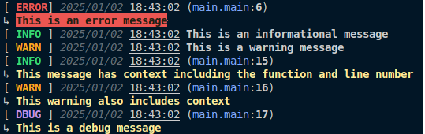

# Logger - A Simple Logging Package for Go

`logger` is a simple and customizable logging package for Go. It allows you to log messages with various levels such as `Error`, `Info`, `Warn`, and `Debug`. Each log message includes the timestamp, log level, function name, and line number for better traceability.

## Features

- **Error Logging**: Logs errors with detailed information, including function name and line number.
- **Info Logging**: Logs informational messages with a timestamp.
- **Warn Logging**: Logs warnings with a timestamp.
- **Debug Logging**: Logs debug information, including function and line number.
- **Colorized Output**: Logs are printed with color formatting for better visibility.

## Installation

To use the `logger` package in your Go project, simply run:

```bash
go get github.com/pecet3/logger
```

## Usage

```
package main

import (
	"github.com/pecet3/logger"
)

func main() {
	// Example of logging an error
	logger.Error("This is an error message")

	// Example of logging information
	logger.Info("This is an informational message")

	// Example of logging a warning
	logger.Warn("This is a warning message")

	// Example of logging with function and line number context (InfoC, WarnC, DebugC)
	logger.InfoC("This message has context including the function and line number")
	logger.WarnC("This warning also includes context")
	logger.Debug("This is a debug message")
}
```

## Examples


